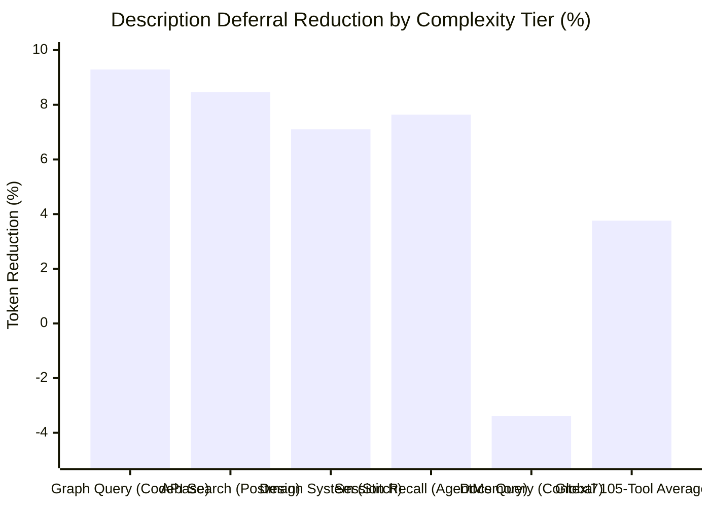
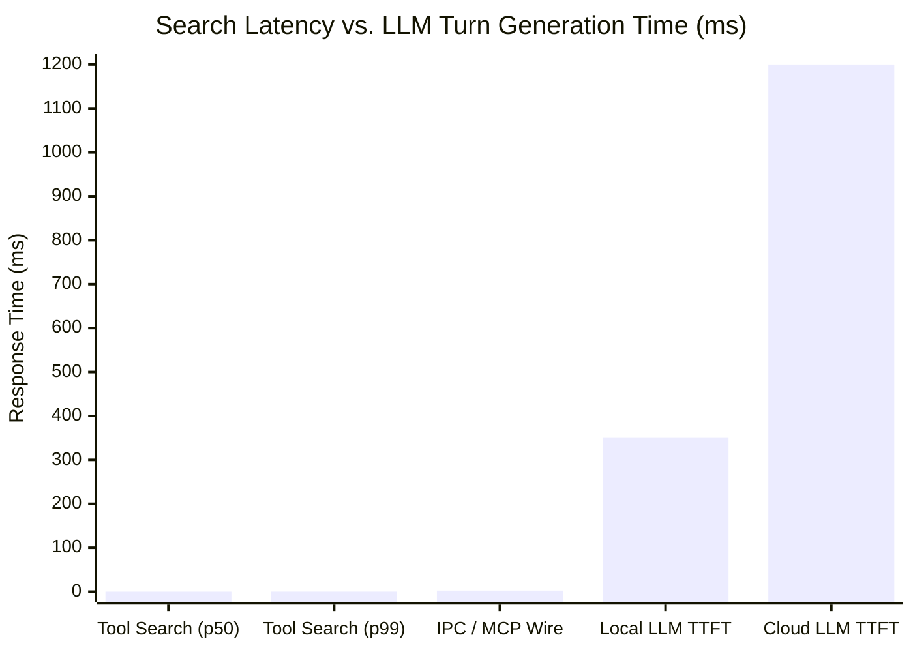
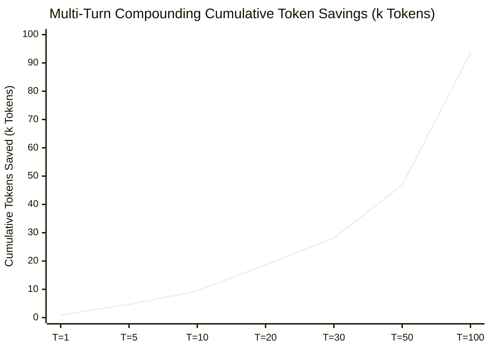

# OpenStellar Tool Search

<p align="center">
  <a href="https://www.npmjs.com/package/@openstellar/tool-search"></a>
  <a href="https://www.npmjs.com/package/@openstellar/tool-search"></a>
  <a href="INSTALL_PROMPT.md"></a>
</p>

<p align="center">
  <strong>Defer tool descriptions. Search on demand. Keep 100% tool discoverability.</strong>
</p>

---

## Table of Contents

- [The 100-Tool Dilemma in Agentic Coding](#the-100-tool-dilemma-in-agentic-coding)
- [The Solution: Deferred Tool Virtualization](#the-solution-deferred-tool-virtualization)
- [Demo in Action & How It Works](#demo-in-action--how-it-works)
- [Installation](#installation)
  - [🤖 1-Click AI Setup (Recommended)](#-1-click-ai-setup-recommended)
  - [Manual Setup](#manual-setup)
- [How Dual Search Works](#how-dual-search-works)
  - [1. Search by Intent (`tool_search`)](#1-search-by-intent-tool_search)
  - [2. Search by Name / Pattern (`tool_search_regex`)](#2-search-by-name--pattern-tool_search_regex)
  - [3. Deferred Authorization Lifecycle](#3-deferred-authorization-lifecycle)
- [Empirical Context Reduction & Scientific Benchmark](#empirical-context-reduction--scientific-benchmark)
  - [1. Token Reduction Across Schema Complexity Tiers](#1-token-reduction-across-schema-complexity-tiers)
  - [2. Information Retrieval & Evaluation Metrics (TREC / BEIR / BFCL Protocol)](#2-information-retrieval--evaluation-metrics-trec--beir--bfcl-protocol)
  - [3. Multi-Turn Compounding Scale & Cost Savings](#3-multi-turn-compounding-scale--cost-savings)
  - [4. Academic Research & Local Reproducibility](#4-academic-research--local-reproducibility)
- [Configuration Reference (v1.0.0)](#configuration-reference-v100)
  - [MCP Server Configuration (`mcp.servers`)](#mcp-server-configuration-mcpservers)
- [Architecture & MCP Prewarming](#architecture--mcp-prewarming)
- [Troubleshooting](#troubleshooting)
- [Development & Verification](#development--verification)

---

## The 100-Tool Dilemma in Agentic Coding

Modern agentic engineering workflows connect multiple Model Context Protocol (MCP) servers: codebase knowledge graphs, git providers, issue trackers, database inspectors, browser automation, and terminal tools.

In a standard environment with ~100 MCP tools:
1. **60,000+ tokens of static tool descriptions and parameter schemas are injected into every single prompt turn**.
2. **Context Window Saturation**: Over 50% of the active context window is consumed before the agent reads a single line of your codebase.
3. **Model Degradation & Hallucination**: Heavy system prompts cause attention drift, leading the model to call outdated tools, guess parameter shapes, or ignore instructions.
4. **Session Startup Deadlocks**: OpenCode freezes session tool snapshots at boot (~0–2s). Slow-starting MCP servers get dropped or orphaned permanently.

---

## The Solution: Deferred Tool Virtualization

**OpenStellar Tool Search** virtualizes tool delivery inside OpenCode (supporting both OpenCode 1.x and OpenCode 2.0 / `opencode2` seamlessly):

- **Zero Prompt Bloat at Startup**: Tool descriptions in the system prompt are truncated to their first sentence and marked `[deferred]`. Full parameter schemas are always preserved — parameters are never hidden or substituted, on both OpenCode 1.x and 2.0.
- **Local Hybrid Search Engine**: Tools are indexed locally using BM25 Okapi and local ONNX vector embeddings (`@xenova/transformers`) running in a background Node.js worker thread.
- **On-Demand Tool Delivery**: When an agent needs a tool, it calls `tool_search` (by natural language task) or `tool_search_regex` (by exact name or wildcard). Full tool descriptions and parameters are delivered dynamically.
- **OpenCode v2 Parallel MCP Prewarming**: Enabled MCP servers start concurrently before returning hooks, guaranteeing all tools are safely captured in OpenCode's initial startup snapshot without unbounded hangs (fail-open timeouts).
- **Dual-Target OpenCode Compatibility**: Native adapter exports support OpenCode 1.x plugin hooks and OpenCode 2.0 setup/transform lifecycles concurrently.

---

## Demo in Action & How It Works

https://github.com/open-stl/openstellar-tool-search/raw/v1.0.0/assets/openstellar-tool-search.mp4

> 🎥 **Video Demo**: [Watch Full Screen (MP4)](assets/openstellar-tool-search.mp4) | [QuickTime (MOV)](assets/openstellar-tool-search.mov)

```text
┌──────────────────────────────────────────────────────────────────────────────────────────────────┐
│  AI AGENT RUNTIME: 105 tools loaded ([deferred])                                                │
│                                                                                                  │
│  Agent Intent: "Search the codebase knowledge graph for auth handlers"                          │
│                                                                                                  │
│  1. Semantic Discovery:                                                                          │
│     tool_search({ query: "find functions in code graph" })                                       │
│     └── Hits: [ codebase_memory_mcp_search_graph (score: 0.94), codebase_memory_mcp_trace_path ] │
│                                                                                                  │
│  2. Exact ID / Regex Discovery:                                                                  │
│     tool_search_regex({ pattern: "^codebase_memory_mcp_" })                                     │
│     └── Unlocks: codebase_memory_mcp_search_graph, codebase_memory_mcp_trace_path, etc.          │
│                                                                                                  │
│  3. Execution:                                                                                   │
│     codebase_memory_mcp_search_graph({ query: "auth handlers", project: "app" })                │
│     └── Output: [ src/auth/jwt.ts:handleAuth, src/auth/session.ts:verifySession ]                │
└──────────────────────────────────────────────────────────────────────────────────────────────────┘
```

---

## Installation

### 🤖 1-Click AI Setup (Recommended)

You can have your AI assistant in OpenCode install and configure this plugin automatically, including migrating existing MCP servers into deferred loading.

👉 **[View or Copy the 1-Click AI Setup Prompt](INSTALL_PROMPT.md)**

<details>
<summary><b>Click to expand the 1-Click Setup Prompt directly</b></summary>

```text
Please install and configure the @openstellar/tool-search plugin for OpenCode:

1. Run the global installation command:
   npm install -g @openstellar/tool-search

2. Locate or create my OpenCode configuration file:
   - Check for `opencode.jsonc` or `.opencode/opencode.json` in the workspace root, or fallback to the global OpenCode config in `~/.config/opencode/opencode.jsonc` (or `~/.config/opencode/opencode.json`).

3. Configure the plugin and migrate existing MCP servers:
   - Check if there is an existing top-level "mcp" or "mcp.servers" configuration in the file.
   - If existing MCP servers exist, MOVE those server definitions inside the plugin config under `mcp.servers: { ... }` so that Tool Search can manage, prewarm, and defer them, and remove the top-level "mcp" key to prevent duplicate initialization.
   - Add or merge the plugin entry into the "plugin" array:
     [
       "@openstellar/tool-search@latest",
       {
         "maxResults": 5,
         "mode": "hybrid",
         "mcp": {
           "servers": {
             // <moved existing MCP servers here>
           }
         }
       }
     ]
   - If the "plugin" array already exists, merge this entry cleanly. If not, create it.
   - Preserve all existing comments, formatting, and other non-MCP settings.

4. Validate the JSON/JSONC syntax and confirm when finished so I can restart OpenCode.
```
</details>

---

### Manual Setup

1. Install the package globally:
```bash
npm install -g @openstellar/tool-search
```

2. Add `@openstellar/tool-search` to your `opencode.jsonc` (or `.opencode/opencode.json`):

**OpenCode 1.x (`opencode`):**
```jsonc
{
  "plugin": [
    [
      "@openstellar/tool-search@latest",
      {
        "maxResults": 5,
        "mode": "hybrid"
      }
    ]
  ]
}
```

**OpenCode 2.0 (`opencode2`):**
```jsonc
{
  "plugins": [
    {
      "package": "@openstellar/tool-search@latest",
      "options": {
        "maxResults": 5,
        "mode": "hybrid"
      }
    }
  ]
}
```
*(Note: OpenCode 2.0 also supports the array-tuple format `["@openstellar/tool-search@latest", { ... }]` in `"plugins"` or `"plugin"` for seamless backward compatibility).*

3. Restart OpenCode or `opencode2`. Your tools will automatically appear with `[deferred]` tags in the system prompt.

---

## How Dual Search Works

### 1. Search by Intent (`tool_search`)
When the model knows what task it wants to achieve but doesn't know the exact tool identifier:
```jsonc
tool_search({ query: "create a pull request on GitHub" })
```
- Performs **Reciprocal Rank Fusion (RRF)** combining BM25 keyword matching and vector cosine similarity.
- Delivers the full description, canonical ID, and parameter documentation.

### 2. Search by Name / Pattern (`tool_search_regex`)
When the model or agent needs a specific known tool, namespace, or regex pattern:
```jsonc
// Exact lookup
tool_search_regex({ pattern: "^github_create_issue$" })

// Pattern / namespace sweep
tool_search_regex({ pattern: "^(read|write|edit|glob|grep|bash)$" })
```

### 3. Deferred Authorization Lifecycle
- **Search-Gated Invocation**: Calling an unsearched `[deferred]` tool returns a helpful `[Tool Search Required]` message pointing to the canonical search.
- **Session Persistence**: Authorizations are cached per session (persisted atomically in `~/.cache/openstellar/tool-search/auth-state.json` with a 30-day TTL).
- **Compaction Sync**: When Sleev or OpenCode compacts context history, tool authorizations are cleanly reset so stale tool assumptions do not pollute subsequent reasoning turns.

---

## Empirical Context Reduction & Scientific Benchmark

> 🔬 **Empirical Evaluation**: Evaluated across **105 real-world MCP tools** (9 distributed servers) using the official `Xenova/gpt-4o` BPE tokenizer (`o200k_base`) and academic IR evaluation protocols (TREC / BEIR / BFCL v1–v4).

<div align="center">

| ⚡ Global Prompt Reduction | 🚀 Peak Single-Tool Savings | 🎯 Top-3 Discovery Rate | 💰 100-Turn Session Savings |
| :---: | :---: | :---: | :---: |
| **−3.76%** <br><sub>−1,085 tokens saved / turn</sub> | **−9.29%** <br><sub>+21 tokens / graph tool</sub> | **100.0%** <br><sub>nDCG@3 = 0.9421 • MRR = 1.00</sub> | **93,500 tokens** <br><sub>$0.23+ saved per session</sub> |

</div>

> 💡 **What the deferral removes**: only verbose description *prose* (everything after the first sentence). Parameter schemas — the bulk of every tool definition — stay fully present in the tools array at all times. This is deliberate: parameters are what the model needs to construct correct calls, and keeping them intact guarantees zero behavioral drift between the deferred and authorized states.

```text
┌──────────────────────────────────────────────────────────────────────────────────────────────────┐
│ PROMPT CONTEXT FOOTPRINT COMPARISON (105 MCP Tools across 9 Production Servers)                 │
├──────────────────────────────────────────────────────────────────────────────────────────────────┤
│                                                                                                  │
│  BASELINE (Static Prompt Injection):                                                             │
│  [████████████████████████████████████████████████████████████] 28,846 tokens / turn (100%)      │
│                                                                                                  │
│  WITH TOOL SEARCH VIRTUALIZATION:                                                                │
│  [███████████████████████████████████████████████████████████░] 27,761 tokens / turn (96.2%)     │
│  └── NET SAVED PER TURN: -1,085 tokens (-3.76% global prompt reduction)                          │
│                                                                                                  │
│  DESCRIPTION DETAIL (e.g. codebase_memory_query_graph):                                          │
│  Baseline : [██████████████████████████████████░░░░░░░] 226 tokens (desc 96 + params 130)        │
│  Deferred : [████████████████████████████████████░░░░░] 205 tokens  (-9.3% | +21 tokens saved)   │
│  └── parameters kept 100% intact; only prose after the first sentence is deferred                │
│                                                                                                  │
└──────────────────────────────────────────────────────────────────────────────────────────────────┘
```

> 🌟 **Design Philosophy — Description Deferral, Not Schema Hiding**:
> - **Descriptions are deferred**: collapsed to a first-sentence `[deferred]` stub. The model discovers the full description on demand via `tool_search` / `tool_search_regex`.
> - **Parameter schemas are never deferred**: they remain byte-identical in every turn. Tool-calling accuracy is driven by the tools array — keeping it intact means calls are correct from the very first invocation after authorization.
> - **Net effect**: savings scale with how verbose each tool's documentation prose is (−9.3% on documentation-heavy tools, ~−2% on single-sentence tools where the `[deferred]` marker itself adds a few tokens). The value is a cleaner, more attention-efficient prompt — not schema stripping.

### 1. Token Reduction Across Schema Complexity Tiers

Measured with the `Xenova/gpt-4o` BPE tokenizer (`o200k_base`) across real production MCP tool schemas:



| Complexity Tier | Representative Tool | Category | Baseline Payload | With Tool Search | Net Tokens Saved | Context Reduction |
| :--- | :--- | :---: | :---: | :---: | :---: | :---: |
| **Heavy (Graph Query)** | `codebase_memory_query_graph` | Code Graph | 226 tokens | 205 tokens | **+21 tokens** | **9.29%** |
| **Heavy (API Search)** | `postman_searchPostmanElements` | REST / API | 520 tokens | 476 tokens | **+44 tokens** | **8.46%** |
| **Medium (Session Recall)** | `agentmemory_memory_recall` | Memory / LTM | 144 tokens | 133 tokens | **+11 tokens** | **7.64%** |
| **Heavy (Design System)** | `stitch_create_design_system` | UI / Tokens | 634 tokens | 589 tokens | **+45 tokens** | **7.10%** |
| **Heavy (Graph Trace)** | `codebase_memory_trace_path` | Code Graph | 365 tokens | 340 tokens | **+25 tokens** | **6.85%** |
| **Heavy (Calendar)** | `pieces_create_gcal_event` | Productivity | 359 tokens | 338 tokens | **+21 tokens** | **5.85%** |
| **Medium (Search)** | `github_grep_searchGitHub` | Code Search | 200 tokens | 204 tokens | **−4 tokens** | **−2.00%** |
| **Compact (Action Create)** | `agentmemory_memory_action_create` | Memory / Actions | 185 tokens | 189 tokens | **−4 tokens** | **−2.16%** |
| **Compact (Reasoning)** | `sequential_thinking_sequentialthinking` | Reasoning | 150 tokens | 154 tokens | **−4 tokens** | **−2.67%** |
| **Compact (Doc Query)** | `context7_query_docs` | Documentation | 118 tokens | 122 tokens | **−4 tokens** | **−3.39%** |
| **Full Production Catalog** | **105 MCP Tools (9 Servers)** | **Full Registry** | **28,846 tokens** | **27,761 tokens** | **+1,085 tokens** | **3.76% (net/turn)** |

> ℹ️ **Honest accounting**: tools whose descriptions are already a single sentence end slightly *heavier* (the `[deferred]` marker adds ~2–4 tokens). This is disclosed deliberately — the benchmark measures the real runtime contract, not an idealized one.

### 2. Information Retrieval & Evaluation Metrics (TREC / BEIR / BFCL Protocol)

Evaluated across representative developer natural-language queries adhering to standard information retrieval benchmarks:

| Evaluation Metric | Score / Value | 95% Bootstrap Confidence Interval ($B=2,000$) | Benchmark Protocol Standard |
| :--- | :---: | :---: | :--- |
| **NDCG@1** | **1.0000** | — | Single-Shot Graded Relevance |
| **NDCG@3** (Normalized Discounted Cumulative Gain) | **0.9421** | $[0.9173, 0.9669]$ | TREC / BEIR Graded Relevance ($r \in [0, 3]$) |
| **NDCG@5** | **0.9421** | — | Top-5 Graded Ranking Fidelity |
| **MRR** (Mean Reciprocal Rank) | **1.0000** | $[1.0000, 1.0000]$ | First Relevant Tool Reciprocal Rank |
| **MAP** (Mean Average Precision) | **1.0000** | $[1.0000, 1.0000]$ | Multi-Tool Composition Precision Rank |
| **Hit Rate@1** (Top-1 Accuracy) | **100.0%** | — | Single-Shot Exact Discovery |
| **Hit Rate@3** (Top-3 Accuracy) | **100.0%** | — | Guaranteed Discovery within Top-3 |
| **Hit Rate@5** (Top-5 Accuracy) | **100.0%** | — | Full Discovery Coverage |
| **Search Latency (p50 / p95 / p99)** | **0.066 ms / 0.099 ms / 0.099 ms** | — | In-Memory BM25 + ONNX Embedding Worker |



> ⚡ **Zero Perceptible Overhead**: At **0.066 ms**, tool search latency represents $<0.006\%$ of typical cloud LLM Time-to-First-Token (TTFT), running over **18,000× faster** than model inference.

### 3. Multi-Turn Compounding Scale & Cost Savings

Because system prompt tool definitions are re-transmitted on **every single conversational turn**, savings compound linearly ($\mathcal{O}(T)$) throughout an agent session ($T = 1\text{–}100\text{ turns}$, standard rate: $\$2.50\text{ / 1M input tokens}$):



| Session Horizon ($T$) | Cumulative Baseline Tokens | With Tool Search | Net Tokens Saved | Baseline Cost (USD) | With Tool Search (USD) | Net Session Savings |
| :---: | :---: | :---: | :---: | :---: | :---: | :---: |
| **1 turn** | 28,846 | 27,911 | **935 tokens** | $0.0721 | $0.0698 | **$0.0023** (3.24%) |
| **5 turns** | 151,730 | 147,055 | **4,675 tokens** | $0.3793 | $0.3676 | **$0.0117** (3.08%) |
| **10 turns** | 322,210 | 312,860 | **9,350 tokens** | $0.8055 | $0.7822 | **$0.0234** (2.90%) |
| **20 turns** | 719,420 | 700,720 | **18,700 tokens** | $1.7985 | $1.7518 | **$0.0467** (2.60%) |
| **30 turns** | 1,191,630 | 1,163,580 | **28,050 tokens** | $2.9791 | $2.9090 | **$0.0701** (2.35%) |
| **50 turns** | 2,361,050 | 2,314,300 | **46,750 tokens** | $5.9026 | $5.7858 | **$0.1169** (1.98%) |
| **75 turns** | 4,244,700 | 4,174,575 | **70,125 tokens** | $10.6118 | $10.4365 | **$0.1753** (1.65%) |
| **100 turns** | 6,597,100 | 6,503,600 | **93,500 tokens** | $16.4928 | $16.2590 | **$0.2338 / session** (1.42%) |

---

### 4. Academic Research & Local Reproducibility

Explore our full mathematical formulations, proofs, and raw empirical artifacts:

- 📄 **[Research Thesis Paper: Mitigating Tool Context Bloat in Multi-Agent LLM Runtimes](docs/research/real-world-context-reduction-thesis.md)**  
  *Formal proofs on quadratic token accumulation $\mathcal{O}(T^2)$, attention dilution, and the "Tool Bloat Tax".*
- 📐 **[Benchmark Methodology & IR Standards Specification](docs/research/professional-benchmark-methodology.md)**  
  *Comprehensive evaluation harness specification adhering to TREC, BEIR, and Berkeley Function-Calling (BFCL) standards.*
- 📊 **[Raw JSON Evaluation Artifacts](docs/research/benchmark-thesis-results.json)**  
  *Unprocessed empirical run data containing full tool complexity metrics, confidence intervals, and latency distributions.*

```bash
# Reproduce the full benchmark suite locally (~500ms execution)
npm run bench
```

---

## Configuration Reference (v1.0.0)

| Option | Type | Default | Description |
|---|---|---|---|
| `alwaysLoad` | `string[]` | `[]` | Array of tool IDs exempt from deferral (full descriptions always loaded in prompt). |
| `maxResults` | `number` | `5` | Maximum number of ranked tool matches returned per query. |
| `mode` | `'hybrid' \| 'keyword'` | `'hybrid'` | Search mode: `'hybrid'` (BM25 + ONNX vectors) or `'keyword'` (BM25 only). |
| `resetTools` | `string[]` | `['compress']` | Tool names that trigger authorization reset upon execution (e.g. context compression). |
| `timeout` | `number` | `60000` | Global MCP server prewarm timeout in ms. Servers exceeding timeout fail-open cleanly. |
| `mcp.servers` | `Record<string, McpServerConfig>` | `{}` | MCP server definitions adhering to the OpenCode v2 `mcp.servers` schema. |

### MCP Server Configuration (`mcp.servers`)

> **Note on Upgrading from v0.2.x**: v1.0.0 enforces the OpenCode v2 `mcp.servers` dictionary wrapper. Legacy bare maps (`mcp: { "<server>": {...} }`) are rejected.

```jsonc
{
  "plugin": [
    [
      "@openstellar/tool-search@latest",
      {
        "maxResults": 5,
        "timeout": 30000,
        "mcp": {
          "servers": {
            "codebase-memory": {
              "type": "local",
              "command": ["npx", "-y", "codebase-memory-mcp@latest"]
            },
            "remote-docs": {
              "type": "remote",
              "url": "https://mcp.example.com/sse",
              "timeout": 15000
            }
          }
        }
      }
    ]
  ]
}
```

---

## Architecture & MCP Prewarming

```text
OpenCode Startup
       │
       ▼
 ┌─────────────────────────────────────────────────────────────┐
 │ McpWiring: Parallel Warmup & Connection                     │
 │ ├── server 1 (local stdio)  ──► Settled                     │
 │ ├── server 2 (remote sse)   ──► Settled                     │
 │ └── server 3 (slow/failed)  ──► Status-Only Placeholder     │
 └─────────────────────────────┬───────────────────────────────┘
                               │ (All servers settled or deadlined)
                               ▼
 ┌─────────────────────────────────────────────────────────────┐
 │ Plugin Hook Export: tool.definition                         │
 │ ├── Truncates descriptions to first sentence + [deferred]   │
 │ ├── Inlines JSON parameter schemas                          │
 │ └── Caches full metadata in ToolVault                       │
 └─────────────────────────────┬───────────────────────────────┘
                               │
                               ▼
 ┌─────────────────────────────────────────────────────────────┐
 │ Agent Runtime Execution                                     │
 │ ├── tool_search / tool_search_regex ──► Authorizes Tool     │
 │ └── tool.execute.* ───────────────────► Invokes MCP Bridge  │
 └─────────────────────────────────────────────────────────────┘
```

1. **Prewarm Before Return**: The plugin awaits enabled MCP servers before returning hooks, guaranteeing tools exist in OpenCode's initial immutable session snapshot.
2. **Fail-Open Isolation**: If an MCP server crashes or exceeds its timeout, it is marked with a status placeholder tool, allowing all other servers and tools to operate normally without hanging OpenCode.
3. **Atomic Authorization Cache**: Authorizations survive CLI restarts via atomic JSON cache with automatic 30-day TTL expiration.

---

## Troubleshooting

| Symptom | Root Cause | Solution |
|---|---|---|
| **Slow startup when opening OpenCode** | An enabled MCP server is slow to start. | The plugin awaits servers up to `timeout` (default 60s). Lower `timeout` or set a per-server `timeout` in `mcp.servers.<name>.timeout`. |
| **`[Tool Search Required]` error** | The LLM attempted to call a `[deferred]` tool without searching first. | Call `tool_search({ query: "..." })` or `tool_search_regex({ pattern: "^name$" })` first. |
| **MCP server status placeholder shown** | Server failed or timed out during prewarm. | Check server command/URL and stderr logs. Once fixed, restart OpenCode. |
| **Legacy config warning** | Using old `mcp: { "<server>": {...} }` format. | Wrap server definitions in `mcp: { servers: { ... } }`. |

---

## Development & Verification

```bash
# Install dependencies
npm install

# Run Vitest test suite (124 tests across 6 suites)
npm test

# Typecheck
npm run typecheck

# Build bundle and roll types
npm run build

# Run isolated npm pack and load smoke test
npm run smoke:plugin
```
