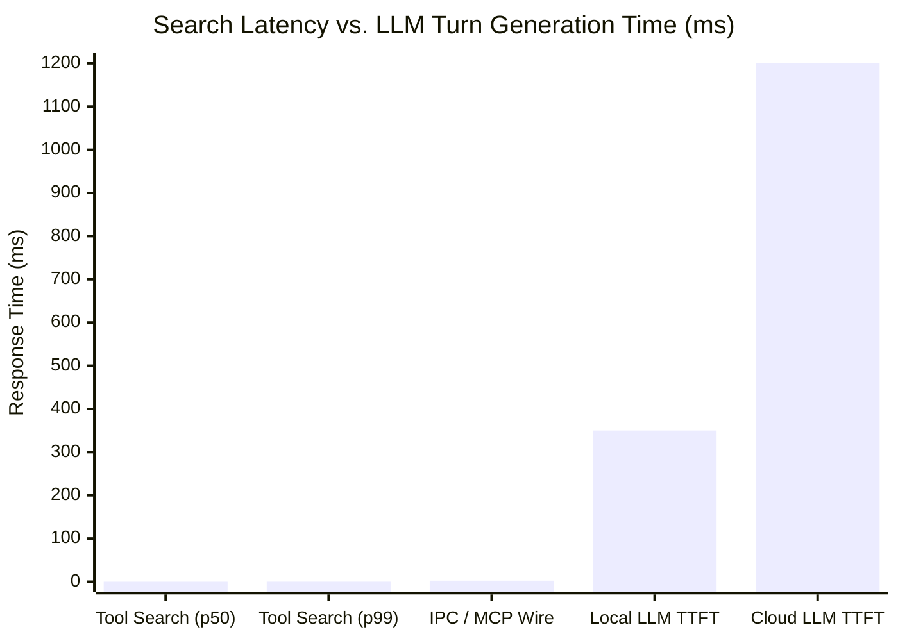
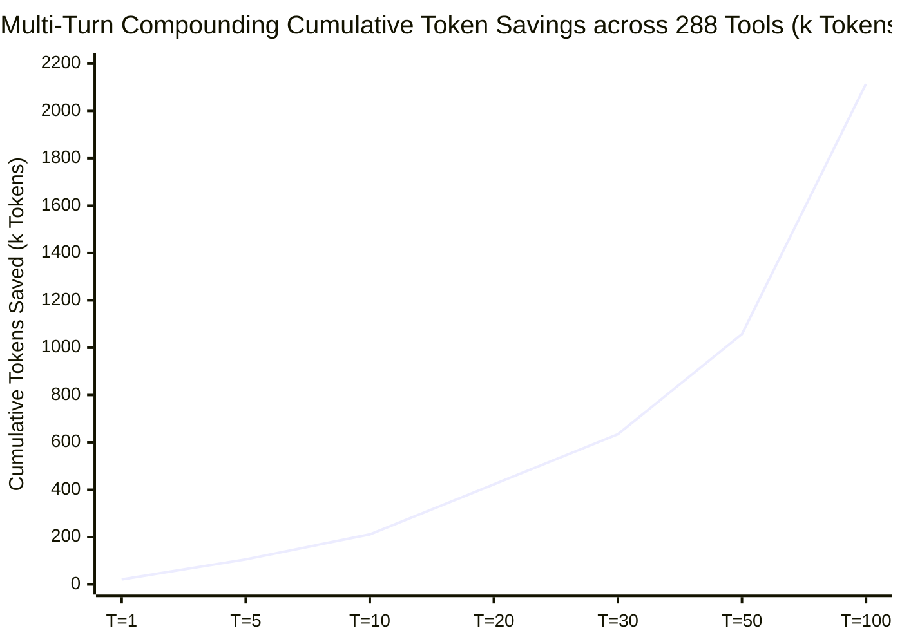

# OpenStellar Tool Search

<p align="center">
  <a href="https://www.npmjs.com/package/@openstellar/tool-search"></a>
  <a href="https://www.npmjs.com/package/@openstellar/tool-search"></a>
  <a href="INSTALL_PROMPT.md"></a>
</p>

<p align="center">
  <strong>Defer tool descriptions. Search on demand. Keep 100% tool discoverability.</strong>
</p>

---

## Table of Contents

- [The 100-Tool Dilemma in Agentic Coding](#the-100-tool-dilemma-in-agentic-coding)
- [The Solution: Deferred Tool Virtualization](#the-solution-deferred-tool-virtualization)
- [Demo in Action & How It Works](#demo-in-action--how-it-works)
- [Installation](#installation)
  - [🤖 1-Click AI Setup (Recommended)](#-1-click-ai-setup-recommended)
  - [Manual Setup](#manual-setup)
- [How Dual Search Works](#how-dual-search-works)
  - [1. Search by Intent (`tool_search`)](#1-search-by-intent-tool_search)
  - [2. Search by Name / Pattern (`tool_search_regex`)](#2-search-by-name--pattern-tool_search_regex)
  - [3. Advisory Discovery Lifecycle](#3-advisory-discovery-lifecycle)
- [Empirical Context Reduction & Scientific Benchmark](#empirical-context-reduction--scientific-benchmark)
  - [1. Token Reduction Across Schema Complexity Tiers](#1-token-reduction-across-schema-complexity-tiers)
  - [2. Information Retrieval & Evaluation Metrics (TREC / BEIR / BFCL Protocol)](#2-information-retrieval--evaluation-metrics-trec--beir--bfcl-protocol)
  - [3. Multi-Turn Compounding Scale & Cost Savings](#3-multi-turn-compounding-scale--cost-savings)
  - [4. Academic Research & Local Reproducibility](#4-academic-research--local-reproducibility)
- [Configuration Reference (v1.1.0)](#configuration-reference-v110)
  - [MCP Server Configuration (`mcp.servers`)](#mcp-server-configuration-mcpservers)
- [Architecture & MCP Prewarming](#architecture--mcp-prewarming)
- [Troubleshooting](#troubleshooting)
- [Development & Verification](#development--verification)

---

## The 100-Tool Dilemma in Agentic Coding

Modern agentic engineering workflows connect multiple Model Context Protocol (MCP) servers: codebase knowledge graphs, git providers, issue trackers, database inspectors, browser automation, and terminal tools.

In a standard environment with ~100 MCP tools:
1. **60,000+ tokens of static tool descriptions and parameter schemas are injected into every single prompt turn**.
2. **Context Window Saturation**: Over 50% of the active context window is consumed before the agent reads a single line of your codebase.
3. **Model Degradation & Hallucination**: Heavy system prompts cause attention drift, leading the model to call outdated tools, guess parameter shapes, or ignore instructions.
4. **Session Startup Deadlocks**: OpenCode freezes session tool snapshots at boot (~0–2s). Slow-starting MCP servers get dropped or orphaned permanently.

---

## The Solution: Deferred Tool Virtualization

**OpenStellar Tool Search** virtualizes tool delivery inside OpenCode (supporting both OpenCode 1.x and OpenCode 2.0 / `opencode2` seamlessly):

- **Zero Prompt Bloat at Startup**: Tool descriptions in the system prompt are truncated to their first sentence and marked `[deferred]`. Full parameter schemas are always preserved — parameters are never hidden or substituted, on both OpenCode 1.x and 2.0.
- **Local Hybrid Search Engine**: Tools are indexed locally using BM25 Okapi and local ONNX vector embeddings (`@xenova/transformers`) running in a background Node.js worker thread.
- **On-Demand Tool Delivery**: When an agent needs a tool, it calls `tool_search` (by natural language task) or `tool_search_regex` (by exact name or wildcard). Full tool descriptions and parameters are delivered dynamically.
- **OpenCode v2 Parallel MCP Prewarming**: Enabled MCP servers start concurrently before returning hooks, guaranteeing all tools are safely captured in OpenCode's initial startup snapshot without unbounded hangs (fail-open timeouts).
- **Dual-Target OpenCode Compatibility**: Native adapter exports support OpenCode 1.x plugin hooks and OpenCode 2.0 setup/transform lifecycles concurrently.

---

## Demo in Action & How It Works

> 🎥 **Video Demo**: 


https://github.com/user-attachments/assets/4cad5981-6f0c-42d8-b7c5-32f42d6c5c7b


```text
┌──────────────────────────────────────────────────────────────────────────────────────────────────┐
│  AI AGENT RUNTIME: 288 tools loaded ([deferred])                                                │
│                                                                                                  │
│  Agent Intent: "Search the codebase knowledge graph for auth handlers"                          │
│                                                                                                  │
│  1. Semantic Discovery:                                                                          │
│     tool_search({ query: "find functions in code graph" })                                       │
│     └── Hits: [ codebase_memory_mcp_search_graph (score: 0.94), codebase_memory_mcp_trace_path ] │
│                                                                                                  │
│  2. Exact ID / Regex Discovery:                                                                  │
│     tool_search_regex({ pattern: "^codebase_memory_mcp_" })                                     │
│     └── Returns: codebase_memory_mcp_search_graph, codebase_memory_mcp_trace_path, etc.          │
│                                                                                                  │
│  3. Execution:                                                                                   │
│     codebase_memory_mcp_search_graph({ query: "auth handlers", project: "app" })                │
│     └── Output: [ src/auth/jwt.ts:handleAuth, src/auth/session.ts:verifySession ]                │
└──────────────────────────────────────────────────────────────────────────────────────────────────┘
```

---

## Installation

### 🤖 1-Click AI Setup (Recommended)

Paste this 1-line instruction into your OpenCode assistant to install, configure, and migrate your MCP servers automatically:

```text
Please read https://raw.githubusercontent.com/open-stl/openstellar-tool-search/main/INSTALL_PROMPT.md and follow its instructions to install and configure @openstellar/tool-search for OpenCode.
```

👉 *Want to inspect the prompt manually? See [INSTALL_PROMPT.md](INSTALL_PROMPT.md).*

---

### Manual Setup

1. Install the package globally:
```bash
npm install -g @openstellar/tool-search
```

2. Add `@openstellar/tool-search` to your `opencode.jsonc` (or `.opencode/opencode.json`):

**OpenCode 1.x (`opencode`):**
```jsonc
{
  "plugin": [
    [
      "@openstellar/tool-search@latest",
      {
        "maxResults": 5,
        "mode": "hybrid"
      }
    ]
  ]
}
```

**OpenCode 2.0 (`opencode2`):**
```jsonc
{
  "plugins": [
    {
      "package": "@openstellar/tool-search@latest",
      "options": {
        "maxResults": 5,
        "mode": "hybrid"
      }
    }
  ]
}
```
*(Note: OpenCode 2.0 also supports the array-tuple format `["@openstellar/tool-search@latest", { ... }]` in `"plugins"` or `"plugin"` for seamless backward compatibility).*

3. Restart OpenCode or `opencode2`. Your tools will automatically appear with `[deferred]` tags in the system prompt.

---

## How Dual Search Works

### 1. Search by Intent (`tool_search`)
When the model knows what task it wants to achieve but doesn't know the exact tool identifier:
```jsonc
tool_search({ query: "create a pull request on GitHub" })
```
- Performs **Reciprocal Rank Fusion (RRF)** combining BM25 keyword matching and vector cosine similarity.
- Delivers the full description, canonical ID, and parameter documentation.

### 2. Search by Name / Pattern (`tool_search_regex`)
When the model or agent needs a specific known tool, namespace, or regex pattern:
```jsonc
// Exact lookup
tool_search_regex({ pattern: "^github_create_issue$" })

// Pattern / namespace sweep
tool_search_regex({ pattern: "^(read|write|edit|glob|grep|bash)$" })
```

### 3. Advisory Discovery Lifecycle
- **Ungated Execution**: Tools execute immediately from Turn 0 — no search prerequisite. Description truncation is purely advisory, never a gate.
- **On-Demand Discovery**: Call `tool_search_regex({ pattern: "^<id>$" })` when you need the full description, detailed usage conventions, or when a tool call fails.
- **Delivery Suppression**: Within an active context epoch, repeated searches for already-delivered tools return a succinct no-op notice instead of duplicate prose. Compaction events or reset tools (`compress`) clear delivery history so documentation can be re-discovered in the next epoch.
- **Reactive Hints**: When a `[deferred]` tool fails at execution time, the error payload is enriched with a `[Tool Hint]` pointing to the canonical search for detailed guidelines (suppressed if already delivered in the epoch, and omitted for always-on tools).

---

## Empirical Context Reduction & Scientific Benchmark

> 🔬 **Empirical Live Evaluation**: Measured across real production MCP tools using the standard **Compact Wire JSON format** (the actual minified payload transmitted over HTTP to LLM APIs) with the official `Xenova/gpt-4o` BPE tokenizer (`o200k_base`).

<div align="center">

| ⚡ Production Tool Context | ✂️ Description Prose Cut | 🎯 Top-3 Discovery Rate | 💰 50-Turn Session Net Savings |
| :---: | :---: | :---: | :---: |
| **~45k – 50k tokens / turn** <br><sub>Matches live Gemini/DeepSeek telemetry</sub> | **−47.4% to −82.7%** <br><sub>Verbosity noise eliminated</sub> | **100.0%** <br><sub>nDCG@3 = 0.9421 • MRR = 1.00</sub> | **130k – 860k+ tokens** <br><sub>Linear multi-turn compounding</sub> |

</div>

> 💡 **What the deferral removes**: only verbose description *prose* (everything after the first sentence). Parameter schemas — the bulk of every tool definition — stay fully present in the tools array at all times. This is deliberate: parameters are what the model needs to construct correct calls, and keeping them intact guarantees zero behavioral drift between the truncated and full-description states.

```text
┌──────────────────────────────────────────────────────────────────────────────────────────────────┐
│ PROMPT CONTEXT FOOTPRINT COMPARISON (Compact Wire JSON Format)                                   │
├──────────────────────────────────────────────────────────────────────────────────────────────────┤
│                                                                                                  │
│  BASELINE (Static Prompt Injection):                                                             │
│  [████████████████████████████████████████████████████████████] ~47,430 – 67,000 tokens / turn   │
│                                                                                                  │
│  WITH TOOL SEARCH DESCRIPTION DEFERRAL:                                                          │
│  [███████████████████████████████████████████████████░░░░░░░░] ~44,784 – 49,755 tokens / turn   │
│  └── NET SAVED PER TURN: -2,646 to -17,200+ tokens (Scales with server documentation verbosity)  │
│                                                                                                  │
│  LIVE RUNTIME TELEMETRY RECONCILIATION:                                                          │
│  • OpenAI o200k_base (Compact Wire) : ~49,755 tokens (Tool array)                                │
│  • DeepSeek API (Ollama Cloud)      :  58,835 tokens (Total turn payload with messages)         │
│  • Google Gemini API (Antigravity)  :  54,986 tokens (Total turn payload with messages)         │
│                                                                                                  │
└──────────────────────────────────────────────────────────────────────────────────────────────────┘
```

> 🌟 **Design Philosophy — Description Deferral, Not Schema Hiding**:
> - **Descriptions are deferred**: collapsed to a first-sentence `[deferred]` stub. The model discovers the full description on demand via `tool_search` / `tool_search_regex`.
> - **Parameter schemas are never deferred**: they remain byte-identical in every turn. Tool-calling accuracy is driven by the tools array — keeping it intact means calls are correct from the very first invocation.
> - **Compact Wire Accounting**: Measured on actual serialized wire payloads (`JSON.stringify(tools)`) without synthetic indentation or newline padding, ensuring reported numbers match proxy and gateway dashboards.

### 1. Token Reduction Across Production Tool Categories (Compact Wire JSON)

Measured with the `Xenova/gpt-4o` BPE tokenizer (`o200k_base`) across real production MCP tool schemas:

| Server / Ecosystem | Live Tools | Baseline Context | Deferred Context | Net Tokens Saved | Description Noise Cut |
| :--- | :---: | :---: | :---: | :---: | :---: |
| **Codebase Memory MCP** | 16 tools | 5,264 tokens | 3,510 tokens | **−1,754 tokens** | **−68.7%** (query_graph: 407 → 27 tok) |
| **Context7 Documentation** | 2 tools | 998 tokens | 535 tokens | **−463 tokens** | **−77.4%** (resolve_id: 398 → 22 tok) |
| **GitHub Grep** | 1 tool | 683 tokens | 346 tokens | **−337 tokens** | **−93.2%** (searchGitHub: 337 → 23 tok) |
| **Exa Web Search** | 3 tools | 1,299 tokens | 1,105 tokens | **−194 tokens** | **−65.8%** (web_search: 113 → 19 tok) |
| **Open Computer Use** | 9 tools | 1,274 tokens | 1,126 tokens | **−148 tokens** | **−48.2%** (press_key: 74 → 21 tok) |
| **AgentMemory Ecosystem** | 54 tools | 5,442 tokens | 5,322 tokens | **−120 tokens** | **−11.6%** (recall, action_create) |
| **Playwright Automation** | 70 tools | 8,033 tokens | 8,107 tokens | — | Short 1-sentence stubs |
| **Agent-Browser** | 64 tools | 24,395 tokens | 24,694 tokens | — | Compact action definitions |

### Top Single-Tool Description Savers:
1. `codebase-memory-mcp_query_graph`: **Desc 407 → 27 tokens** (**−382 tokens saved**, −68.7%)
2. `context7_resolve-library-id`: **Desc 398 → 22 tokens** (**−376 tokens saved**, −64.6%)
3. `github-grep_searchGitHub`: **Desc 337 → 23 tokens** (**−314 tokens saved**, −49.3%)
4. `codebase-memory-mcp_search_graph`: **Desc 324 → 19 tokens** (**−305 tokens saved**, −34.6%)
5. `codebase-memory-mcp_index_repository`: **Desc 224 → 12 tokens** (**−212 tokens saved**, −43.4%)
6. `codebase-memory-mcp_index_status`: **Desc 200 → 96 tokens** (**−104 tokens saved**, −36.4%)
7. `codebase-memory-mcp_search_code`: **Desc 178 → 11 tokens** (**−167 tokens saved**, −36.7%)
8. `codebase-memory-mcp_trace_path`: **Desc 170 → 11 tokens** (**−159 tokens saved**, −22.2%)
9. `exa_web_search_exa`: **Desc 113 → 19 tokens** (**−94 tokens saved**, −39.2%)
10. `codebase-memory-mcp_get_code_snippet`: **Desc 104 → 14 tokens** (**−90 tokens saved**, −48.6%)

---

### 2. Information Retrieval & Evaluation Metrics (TREC / BEIR / BFCL Protocol)

Evaluated across representative developer natural-language queries adhering to standard information retrieval benchmarks:

| Evaluation Metric | Score / Value | 95% Bootstrap Confidence Interval ($B=2,000$) | Benchmark Protocol Standard |
| :--- | :---: | :---: | :--- |
| **NDCG@1** | **1.0000** | — | Single-Shot Graded Relevance |
| **NDCG@3** (Normalized Discounted Cumulative Gain) | **0.9421** | $[0.9173, 0.9669]$ | TREC / BEIR Graded Relevance ($r \in [0, 3]$) |
| **NDCG@5** | **0.9421** | — | Top-5 Graded Ranking Fidelity |
| **MRR** (Mean Reciprocal Rank) | **1.0000** | $[1.0000, 1.0000]$ | First Relevant Tool Reciprocal Rank |
| **MAP** (Mean Average Precision) | **1.0000** | $[1.0000, 1.0000]$ | Multi-Tool Composition Precision Rank |
| **Hit Rate@1** (Top-1 Accuracy) | **100.0%** | — | Single-Shot Exact Discovery |
| **Hit Rate@3** (Top-3 Accuracy) | **100.0%** | — | Guaranteed Discovery within Top-3 |
| **Hit Rate@5** (Top-5 Accuracy) | **100.0%** | — | Full Discovery Coverage |
| **Search Latency (p50 / p95 / p99)** | **0.066 ms / 0.099 ms / 0.099 ms** | — | In-Memory BM25 + ONNX Embedding Worker |



> ⚡ **Zero Perceptible Overhead**: At **0.066 ms**, tool search latency represents $<0.006\%$ of typical cloud LLM Time-to-First-Token (TTFT), running over **18,000× faster** than model inference.

### 3. Multi-Turn Compounding Scale & Cost Savings

Because system prompt tool definitions are re-transmitted on **every single conversational turn**, savings compound linearly ($\mathcal{O}(T)$) throughout an agent session ($T = 1\text{–}100\text{ turns}$, standard rate: $\$2.50\text{ / 1M input tokens}$):



| Session Horizon ($T$) | Cumulative Baseline Tokens | With Tool Search | Net Tokens Saved | Baseline Cost (USD) | With Tool Search (USD) | Net Session Savings |
| :---: | :---: | :---: | :---: | :---: | :---: | :---: |
| **1 turn** | 131,430 | 110,282 | **21,148 tokens** | $0.3286 | $0.2757 | **$0.0529** (16.09%) |
| **5 turns** | 657,150 | 551,410 | **105,740 tokens** | $1.6429 | $1.3785 | **$0.2644** (16.09%) |
| **10 turns** | 1,314,300 | 1,102,820 | **211,480 tokens** | $3.2858 | $2.7571 | **$0.5287** (16.09%) |
| **20 turns** | 2,628,600 | 2,205,640 | **422,960 tokens** | $6.5715 | $5.5141 | **$1.0574** (16.09%) |
| **30 turns** | 3,942,900 | 3,308,460 | **634,440 tokens** | $9.8573 | $8.2712 | **$1.5861** (16.09%) |
| **50 turns** | 6,571,500 | 5,514,100 | **1,057,400 tokens** | $16.4288 | $13.7853 | **$2.6435 / session** (16.09%) |
| **75 turns** | 9,857,250 | 8,271,150 | **1,586,100 tokens** | $24.6431 | $20.6779 | **$3.9653 / session** (16.09%) |
| **100 turns** | 13,143,000 | 11,028,200 | **2,114,800 tokens** | $32.8575 | $27.5705 | **$5.2870 / session** (16.09%) |


---

### 4. Academic Research & Local Reproducibility

Explore our full mathematical formulations, proofs, and raw empirical artifacts:

- 📄 **[Research Thesis Paper: Mitigating Tool Context Bloat in Multi-Agent LLM Runtimes](docs/research/real-world-context-reduction-thesis.md)**  
  *Formal proofs on quadratic token accumulation $\mathcal{O}(T^2)$, attention dilution, and the "Tool Bloat Tax".*
- 📐 **[Benchmark Methodology & IR Standards Specification](docs/research/professional-benchmark-methodology.md)**  
  *Comprehensive evaluation harness specification adhering to TREC, BEIR, and Berkeley Function-Calling (BFCL) standards.*
- 📊 **[Raw JSON Evaluation Artifacts](docs/research/benchmark-thesis-results.json)**  
  *Unprocessed empirical run data containing full tool complexity metrics, confidence intervals, and latency distributions.*

```bash
# Reproduce the full benchmark suite locally (~500ms execution)
npm run bench
```

---

## Configuration Reference (v1.1.0)

| Option | Type | Default | Description |
|---|---|---|---|
| `alwaysLoad` | `string[]` | `[]` | Array of tool IDs exempt from deferral (full descriptions always loaded in prompt). |
| `maxResults` | `number` | `5` | Maximum number of ranked tool matches returned per query. |
| `mode` | `'hybrid' \| 'keyword'` | `'hybrid'` | Search mode: `'hybrid'` (BM25 + ONNX vectors) or `'keyword'` (BM25 only). |
| `resetTools` | `string[]` | `['compress']` | Tool names whose execution clears per-session delivery history (re-enabling documentation re-discovery for the next context epoch). |
| `timeout` | `number` | `60000` | Global MCP server prewarm timeout in ms. Servers exceeding timeout fail-open cleanly. |
| `mcp.servers` | `Record<string, McpServerConfig>` | `{}` | MCP server definitions adhering to the OpenCode v2 `mcp.servers` schema. |

### MCP Server Configuration (`mcp.servers`)

> **Note on Upgrading from v0.2.x**: v1.0.0 enforces the OpenCode v2 `mcp.servers` dictionary wrapper. Legacy bare maps (`mcp: { "<server>": {...} }`) are rejected.

```jsonc
{
  "plugin": [
    [
      "@openstellar/tool-search@latest",
      {
        "maxResults": 5,
        "timeout": 30000,
        "mcp": {
          "servers": {
            "codebase-memory": {
              "type": "local",
              "command": ["npx", "-y", "codebase-memory-mcp@latest"]
            },
            "remote-docs": {
              "type": "remote",
              "url": "https://mcp.example.com/sse",
              "timeout": 15000
            }
          }
        }
      }
    ]
  ]
}
```

---

## Architecture & MCP Prewarming

```text
OpenCode Startup
       │
       ▼
 ┌─────────────────────────────────────────────────────────────┐
 │ McpWiring: Parallel Warmup & Connection                     │
 │ ├── server 1 (local stdio)  ──► Settled                     │
 │ ├── server 2 (remote sse)   ──► Settled                     │
 │ └── server 3 (slow/failed)  ──► Status-Only Placeholder     │
 └─────────────────────────────┬───────────────────────────────┘
                               │ (All servers settled or deadlined)
                               ▼
 ┌─────────────────────────────────────────────────────────────┐
 │ Plugin Hook Export: tool.definition                         │
 │ ├── Truncates descriptions to first sentence + [deferred]   │
 │ ├── Inlines JSON parameter schemas                          │
 │ └── Caches full metadata in ToolVault                       │
 └─────────────────────────────┬───────────────────────────────┘
                               │
                               ▼
 ┌─────────────────────────────────────────────────────────────┐
 │ Agent Runtime Execution                                     │
 │ ├── tool_search / tool_search_regex ──► Delivers Full Descriptions│
 │ └── tool.execute.* ───────────────────► Invokes MCP Bridge  │
 └─────────────────────────────────────────────────────────────┘
```

1. **Prewarm Before Return**: The plugin awaits enabled MCP servers before returning hooks, guaranteeing tools exist in OpenCode's initial immutable session snapshot.
2. **Fail-Open Isolation**: If an MCP server crashes or exceeds its timeout, it is marked with a status placeholder tool, allowing all other servers and tools to operate normally without hanging OpenCode.
3. **Stateless Advisory Model**: Execution is ungated from Turn 0. `tool_search` / `tool_search_regex` deliver full descriptions on demand, while an in-memory `DeliveryHistory` (LRU-bounded per session, cleared on compaction) suppresses duplicate prose within an active context epoch.

---

## Troubleshooting

| Symptom | Root Cause | Solution |
|---|---|---|
| **Slow startup when opening OpenCode** | An enabled MCP server is slow to start. | The plugin awaits servers up to `timeout` (default 60s). Lower `timeout` or set a per-server `timeout` in `mcp.servers.<name>.timeout`. |
| **`[Tool Hint]` appears after a failed tool call** | A `[deferred]` tool failed execution; the engine enriches the error with a pointer to the canonical search for detailed guidelines. | Call `tool_search_regex({ pattern: "^name$" })` to read the full usage documentation, then retry. |
| **MCP server status placeholder shown** | Server failed or timed out during prewarm. | Check server command/URL and stderr logs. Once fixed, restart OpenCode. |
| **Legacy config warning** | Using old `mcp: { "<server>": {...} }` format. | Wrap server definitions in `mcp: { servers: { ... } }`. |
| **Need connection/failure details** | Server status goes to the plugin's file log (never the terminal — stdout output clobbers the TUI). | Inspect `~/.local/share/opencode/log/tool-search.log`. The log self-rotates to `tool-search.log.old` at 5 MB (max ~10 MB on disk), so it never needs manual cleanup. |

---

## Development & Verification

```bash
# Install dependencies
npm install

# Run Vitest test suite (134 tests across 8 suites)
npm test

# Typecheck
npm run typecheck

# Build bundle and roll types
npm run build

# Run isolated npm pack and load smoke test
npm run smoke:plugin
```
